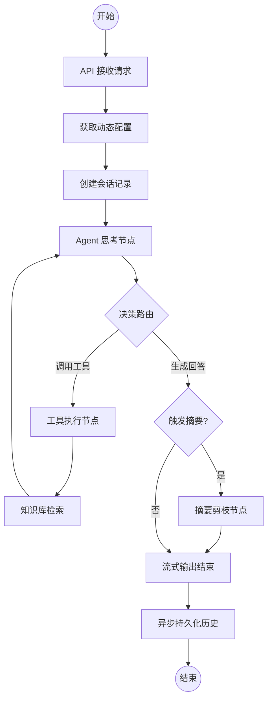

# AI 对话系统架构与 RAG 逻辑文档

本文档详细介绍了 CatWiki AI 对话系统的核心架构、处理流程以及针对 RAG（检索增强生成）质量与效率所做的深度设计。

## 1. 核心架构：基于 LangGraph 的 ReAct 模式

系统采用了 **ReAct (Reasoning and Acting)** 范式，利用 [LangGraph](https://langchain-ai.github.io/langgraph/) 构建了一个有状态的循环工作流。

### 1.1 状态机工作流 (Graph Workflow)

系统通过状态机管理对话逻辑，确保推理与行为的解耦。

### 1.2 核心节点说明
- **Agent 节点**: 负责决策。LLM 根据 `SystemPrompt` 和历史上下文，决定是直接回答用户，还是通过调工具获取信息。
- **Tools 包装节点**: 包含防护逻辑。监测 `iteration_count` 和 `consecutive_empty_count`，防止 Agent 陷入无限搜索循环。
- **Summarize 节点**: 长期记忆管理。当对话长度触及阈值时，自动提取关键点并剪枝历史（RemoveMessage），在保证上下文连续性的同时节省 Token。

---

## 2. RAG 检索深度优化 (Vector Service)

系统通过多阶段处理确保召回的精准度。

### 2.1 请求生命周期中的检索流程
1. **语义召回 (Recall)**: 
   - 过滤条件：支持基于 `site_id` 的多租户隔离。
   - 深度：初始召回 `recall_k` 设置为 50-100 个分片。
2. **精排重测 (Rerank)**: 
   - 调用 Reranker 模型对候选集进行二次打分。
   - 动态调整：如果开启重排序，则仅返回得分最高的 Top K 个分片。
3. **上下文注入**: 
   - 检索结果以 JSON 格式注入 `ToolMessage`，包含分片的 `content` 和 `source_index`。

---

## 3. 消息持久化与状态恢复

系统采用“双轨制”存储，兼顾运行效率与审计需求。

### 3.1 运行态：SQL Checkpointer
- 基于 `LangGraph` 的 `SqliteSaver/PostgresSaver`。
- **作用**: 记录图的原子状态，支持跨请求的断点续连和 ReAct 循环的中断恢复。
- **Thread ID**: 每个用户会话拥有独立的线索 ID。

### 3.2 审计态：全量消息表 (`ChatMessage`)
- **作用**: 存储 OpenAI 兼容格式的原始消息流。
- **包含内容**: 人类问题、AI 思考、中间工具调用参数、工具返回结果以及 Token 消耗统计。
- **异步保存**: 每一轮对话结束后，通过 FastAPI `BackgroundTasks` 异步同步到 SQL，零延迟影响用户体验。

---

## 4. 引用来源提取策略 (Citation Strategy)

系统确保回答中标记的 `[n]` 与展示的引用列表一致。

### 4.1 提取机制 (Index-Link)
- **提取源**: 系统遍历当前轮次产生的所有 `ToolMessage`。
- **提取逻辑**: 目前采用 **全量提取模式**。系统会收集最后一次用户提问后召回的所有文档，并将其元数据（标题、得分、站点 ID）透传给前端渲染。
- **全局索引**: 工具返回给 AI 的每个分片都带有全局唯一的 `source_index`。AI 被要求严格按照该序号在正文中使用 `[n]` 进行标注。

---

## 5. 性能优化 (Performance)

- **DynamicConfig 缓存**: 配置管理器对 AI 模型参数进行 5 分钟 TTL 缓存，避免了每秒高频查询数据库导致的 TTFT（首包延迟）增加。
- **原子更新**: 使用 SQL `update(ChatSession).values(message_count=ChatSession.message_count + 1)` 确保并发状态下计数器的准确性。

---

## 6. 配置与调优 (Environment Variables)

系统支持通过环境变量动态调整 RAG 质量与性能。

### 6.1 RAG 核心参数项
| 变量名 | 默认值 | 说明 |
| :--- | :--- | :--- |
| `RAG_RECALL_K` | 50 | 初始向量召回数量（海选池大小） |
| `RAG_RECALL_THRESHOLD` | 0.3 | 向量检索相似度阈值 |
| `RAG_ENABLE_RERANK` | true | 显式开启/关闭重排序精排阶段 |
| `RAG_RERANK_TOP_K` | 5 | 最终喂给 AI 的精选文档数量 |
| `RAG_RECALL_MAX` | 100 | 全局召回硬上限，保护 Reranker 性能 |
